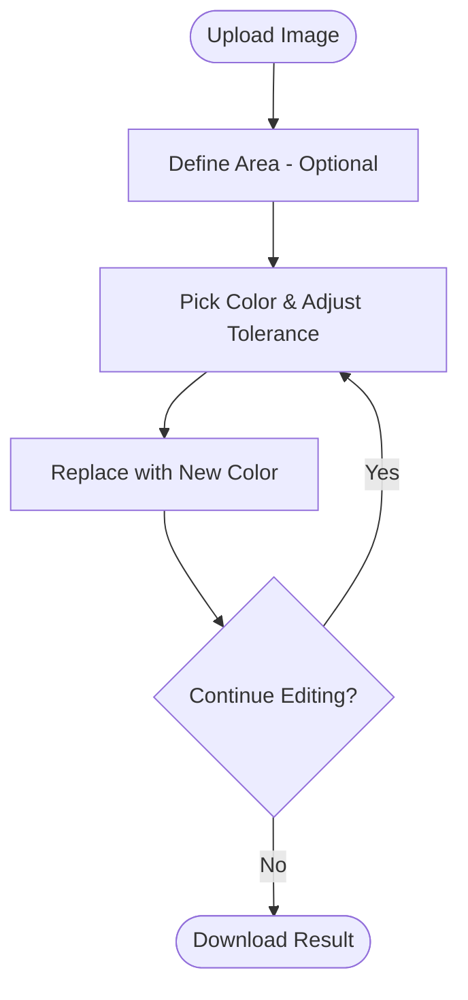

# IconTool - Image Color Picker & Replacer

A pure frontend image processing tool that allows users to upload images, pick specific colors, and replace them with new colors. Supports regional limits and tolerance adjustments.

## Features

- **Pure Frontend**: All operations are done in the browser, no server upload, ensuring privacy.
- **Regional Replacement**: Supports limiting the processing area by drawing a rectangle.
- **Tolerance Adjustment**: Adjust color matching tolerance to handle gradients or similar colors easily.
- **Real-time Preview**: Highlights pixels to be replaced in real-time when adjusting tolerance.
- **Multi-format Support**: Supports common formats like PNG, JPG, WebP, GIF, etc.

## Workflow

1. **Upload Image**: Click or drag an image to the upload area.
2. **Define Area (Optional)**: Click "Draw Rectangle" and drag on the preview if you only want to modify part of the image.
3. **Pick Color**: Click the color you want to replace on the image.
4. **Adjust Tolerance**: Drag the slider and observe the pink highlight to ensure all target pixels are selected.
5. **Set New Color**: Use the color picker or enter RGB values manually.
6. **Confirm Replacement**: Click "Confirm Replace" to apply changes.
7. **Download**: Click "Download Modified Image" to save the result.

## Flowchart

## Tech Stack

- HTML5 Canvas
- CSS3 (Flexbox/Grid/Variables)
- Vanilla JavaScript (ES6+)

## Deployment

As a pure static project, you can run it by opening `index.html` in a browser or deploy it using any static file server (e.g., Live Server, nginx, GitHub Pages).
